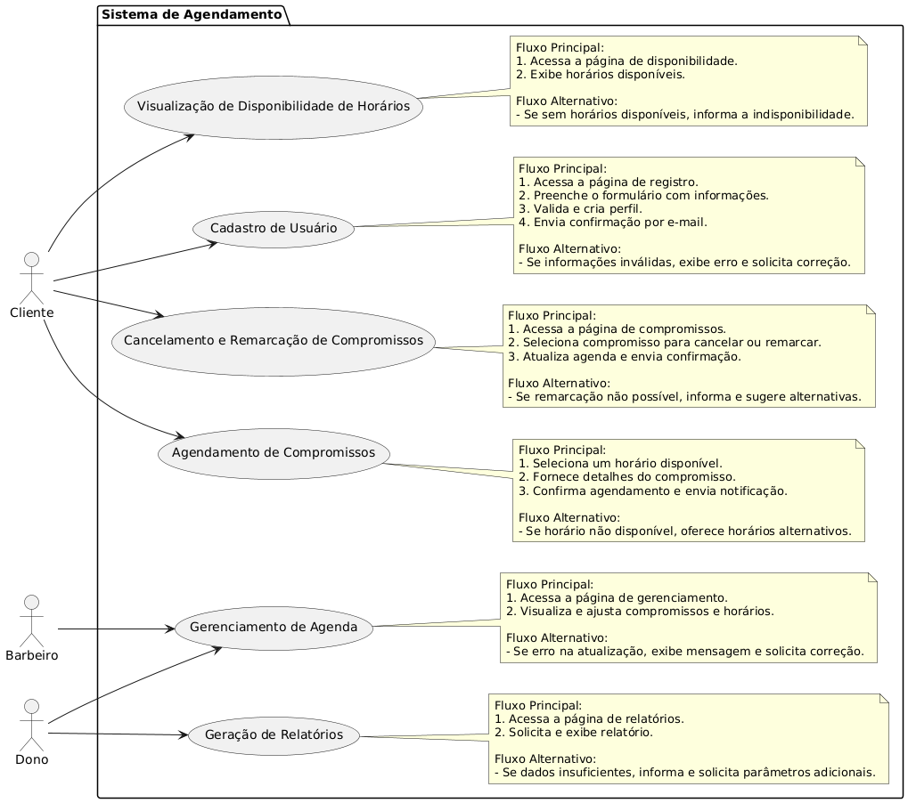
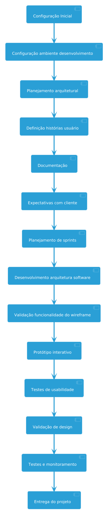
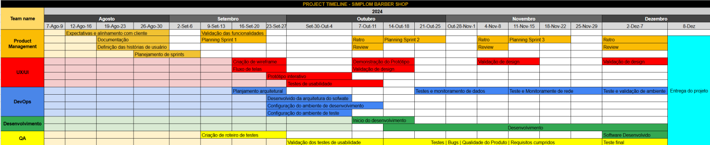

# Especificações do Projeto

Pré-requisitos: <a href="1-Documentação de Contexto.md"> Documentação de Contexto</a>

Definição do problema e ideia de solução a partir da perspectiva do usuário. É composta pela definição do  diagrama de personas, histórias de usuários, requisitos funcionais e não funcionais além das restrições do projeto.

Apresente uma visão geral do que será abordado nesta parte do documento, enumerando as técnicas e/ou ferramentas utilizadas para realizar a especificações do projeto

## Personas

- Persona: Caio Cesar 

Idade: 16 anos 

Ocupação: Estudante do ensino médio (período da manhã) 

Renda: Recebe mesada mensal e faz trabalhos de freelancer 

Comportamento:  Gabriel é bastante conectado com a tecnologia, utilizando sempre aplicativos para resolver praticamente tudo em sua vida. Ele gosta de marcar compromissos de maneira rápida sem a necessidade de interação direta com as pessoas. Seus horários são limitados devido à escola e compromissos extracurriculares, como treinos de futebol e seus trabalhos como freelancer. 

Necessidades: Gabriel precisa de um sistema que lhe permita marcar horários sem precisar “gastar” tempo com trocas de mensagens.

Frustrações: Não gosta de ficar esperando por muito tempo a resposta sobre a marcação do horário e odeia quando não consegue marcar horários porque esquece de entrar em contato com antecedência.

- Persona: Elieni (mãe de família)

Idade: 42 anos 

Ocupação: Tecnica de enfermagem

Estado Civil: Divorciada, com 3 filhos sendo dois gêmeos de 11anos 

Comportamento: Elieni tem uma rotina bastante agitada, tendo que conciliar os dois trabalhos, com a faculdade, os com os cuidados com a casa e o tempo com os filhos. Ela gosta de coisa com eficiência. Às vezes, precisa marcar horários de última hora, para os filhos e não gosta de ter que esperar muito tempo por respostas pelo whatApp. 

Necessidades: Quer um sistema onde possa verificar rapidamente a disponibilidade de horários, até mesmo se tem horário de última hora, e fazer o agendamento diretamente, sem precisar enviar mensagens ou confirmar via WhatsApp. 

Frustrações: Fica frustrada quando precisa entrar em contato várias vezes para conseguir marcar um horário ou quando não consegue um agendamento de última hora por falta de uma visão clara da disponibilidade.

- Persona: Fabio (Dono da Barbearia e barbeiro) 

Idade: 52 anos 

Ocupação: Dono e um dos barbeiros da Barbearia Simplom 

Comportamento: Fabio é apaixonado pelo trabalho como barbeiro e tem uma clientela fiel. Porém, ele se sente sobrecarregado com a necessidade de gerenciar os agendamentos via WhatsApp, o que consome muito tempo e torna difícil focar nos atendimentos. Ele gostaria de uma solução que automatize o processo de marcação, liberando mais tempo para focar nos clientes e no crescimento da barbearia. 

Necessidades: Precisa de uma ferramenta que permita que os clientes façam suas reservas de forma autônoma, sem que ele precise ficar marcando manualmente os horários. Quer mais controle sobre sua agenda, visualizando facilmente os horários disponíveis e evitando erros. 

Frustrações: Perde muito tempo respondendo mensagens para confirmar horários e acaba cometendo erros ao tentar gerenciar tudo manualmente.
Lembre-se que você deve ser enumerar e descrever precisamente e personalizada todos os clientes ideais que sua solução almeja.

## Histórias de Usuários

Com base na análise das personas foram identificadas as seguintes histórias de usuários:

|EU COMO... `PERSONA`| QUERO/PRECISO ... `FUNCIONALIDADE` |PARA ... `MOTIVO/VALOR`                 |
|--------------------|------------------------------------|----------------------------------------|
|Um cliente  (Caio Ceza)  | poder agendar horários de maneira rápida e automática           | que possa garantir seu corte sem precisar interagir diretamente com o barbeiro               |
|Um cliente  (Caio Ceza)       | receber lembretes de seus agendamentos                 | não esquecer o horário e perder o compromisso |
|mãe de família (Elieni)       | verificar a disponibilidade de horários rapidamente                 | que possa agendar para si e seus filhos sem perder tempo com trocas de mensagens |
|mãe de família (Elieni)       |  agendar horários de última hora de forma eficiente                 | não ter que aguardar longas confirmações |
| dono e barbeiro (Fabio)       | quer que os clientes possam agendar de forma autônoma                 | que ele possa focar em seus atendimentos sem precisar gerenciar a agenda manualmente |
|dono e barbeiro (Fabio)       | visualizar e controlar sua agenda de maneira clara e organizada                 | para evitar erros e sobrecarga |

## Requisitos

As tabelas que se seguem apresentam os requisitos funcionais e não funcionais que detalham o escopo do projeto. Para determinar a prioridade de requisitos, aplicar uma técnica de priorização de requisitos e detalhar como a técnica foi aplicada.

### Requisitos Funcionais

| ID    | Descrição do Requisito                                               | Prioridade |
|-------|----------------------------------------------------------------------|------------|
| RF-001| Permitir que os usuários se cadastrem e criem perfis                 | ALTA       |
| RF-002| Exibir a disponibilidade de horários de forma clara e atualizada     | ALTA       |
| RF-003| Permitir o agendamento de compromissos diretamente através do sistema | ALTA       |
| RF-004| Enviar notificações automáticas para confirmar compromissos e lembrar antes do horário marcado | ALTA       |
| RF-005| Permitir cancelamento e remarcação de compromissos de forma fácil    | ALTA       |
| RF-006| Fornecer uma interface para gerenciamento de agenda, incluindo visualização de compromissos e horários disponíveis | ALTA       |
| RF-007| Gerar relatórios sobre agendamentos, como número de compromissos e taxa de cancelamento | MÉDIA      |
| RF-008| Permitir integração com calendários pessoais (Google Calendar, Outlook) | MÉDIA      |

## Requisitos Não Funcionais

| ID     | Descrição do Requisito                                                      | Prioridade |
|--------|-----------------------------------------------------------------------------|------------|
| RNF-001| O sistema deve ser responsivo para rodar em dispositivos móveis               | MÉDIA      |
| RNF-002| Deve processar requisições do usuário em no máximo 3 segundos                  | BAIXA      |
| RNF-003| As informações dos usuários devem ser armazenadas e transmitidas de forma segura | ALTA       |
| RNF-004| A interface deve ser intuitiva e fácil de usar para todos os perfis de usuário  | ALTA       |
| RNF-005| O sistema deve estar disponível 24/7                                          | ALTA       |
| RNF-006| O sistema deve ser compatível com diferentes dispositivos e navegadores        | ALTA       |
| RNF-007| Deve ser escalável para suportar um aumento no número de usuários e dados       | ALTA       |
| RNF-008| O sistema deve ter mecanismos de backup regulares e recuperação de dados        | ALTA       |

## Restrições

| ID  | Restrição                                            |
|-----|------------------------------------------------------|
| 01  | O projeto deverá ser entregue até o final do semestre |
| 02  | Não pode ser desenvolvido um módulo de backend       |
| 03  | O orçamento para o projeto deve ser respeitado, sem exceder os limites estabelecidos |
| 04  | O sistema deve ser desenvolvido usando a infraestrutura tecnológica disponível e compatível com os recursos da equipe |
| 05  | Deve haver treinamento para usuários e administradores para utilizar o sistema de forma eficaz |
| 06  | O sistema deve considerar os custos associados a qualquer software de terceiros ou serviços externos utilizados |
| 07  | A manutenção contínua e o suporte ao cliente devem estar previstos no desenvolvimento e operação do sistema |
| 08  | O sistema deve estar em conformidade com as regulamentações locais e internacionais de proteção de dados |

# Diagrama de Casos de Uso

## Casos de Uso

| ID  | Nome do Caso de Uso                                   | Descrição Sucinta                                                                 |
|-----|--------------------------------------------------------|-----------------------------------------------------------------------------------|
| UC1 | Cadastro de Usuário                                   | Permite que o usuário crie uma conta no sistema fornecendo informações básicas.   |
| UC2 | Visualização de Disponibilidade de Horários           | Exibe a disponibilidade de horários para agendamentos.                            |
| UC3 | Agendamento de Compromissos                           | Permite que o cliente agende compromissos escolhendo um horário disponível.      |
| UC4 | Cancelamento e Remarcação de Compromissos             | Permite que o cliente cancele ou remarque compromissos existentes.                |
| UC5 | Gerenciamento de Agenda                               | Permite que o barbeiro ou administrador gerencie sua agenda e horários disponíveis.|
| UC6 | Geração de Relatórios                                 | Gera relatórios sobre compromissos agendados e outras métricas.                   |

## Atores

| ID  | Nome do Ator          | Descrição Sucinta                                                              |
|-----|------------------------|--------------------------------------------------------------------------------|
| c   | Cliente                | Usuário que agenda, cancela, e visualiza compromissos.                          |
| b   | Barbeiro               | Profissional que gerencia sua agenda e atende clientes.                        |
| a   | Administrador          | Usuário que gerencia a agenda e gera relatórios sobre compromissos.             |

# Gerenciamento de Projeto

De acordo com o PMBoK v6 as dez áreas que constituem os pilares para gerenciar projetos, e que caracterizam a multidisciplinaridade envolvida, são: Integração, Escopo, Cronograma (Tempo), Custos, Qualidade, Recursos, Comunicações, Riscos, Aquisições, Partes Interessadas. Para desenvolver projetos um profissional deve se preocupar em gerenciar todas essas dez áreas. Elas se complementam e se relacionam, de tal forma que não se deve apenas examinar uma área de forma estanque. É preciso considerar, por exemplo, que as áreas de Escopo, Cronograma e Custos estão muito relacionadas. Assim, se eu amplio o escopo de um projeto eu posso afetar seu cronograma e seus custos.

## Gerenciamento de Tempo

Inicialmente elaboramos um diagrama com base na concepção preliminar do projeto, visando assegurar uma organização regrada e eficaz. Esse diagrama facilitará a programação e a coordenação das atividades, proporcionando uma estimativa precisa do tempo necessário para a conclusão do projeto, bem como um gerenciamento eficiente e absoluto do cronograma.

## Gerenciamento de Equipe

Project Timeline: <a href="[1-Documentação de Contexto.md](https://docs.google.com/spreadsheets/d/1PBKknGin72xqk5tDTb0Ir0MFV3jRVsZ0LldXQSGLYak/edit?usp=sharing)"> Acesse esse link para ver a timeline completa </a>

## Gestão de Orçamento

Após um extenso processo de cálculos, conversas detalhadas e pesquisas, chegamos ao orçamento para o projeto, que ficou um total de R$ 32.400 para um período de quatro meses. Este valor foi muito bem planejado para cobrir todas as áreas essenciais do projeto, conforme detalhado na imagem a seguir:

Este orçamento foi cuidadosamente planejado para assegurar que todas as áreas essenciais do projeto sejam devidamente cobertas, com uma abordagem eficiente e econômica. Estamos comprometidos em utilizar esses recursos de maneira a maximizar o valor entregue e garantir o sucesso do projeto.

