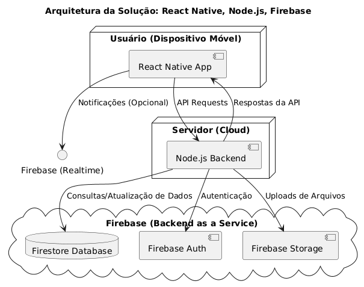
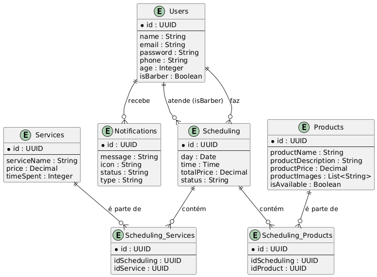
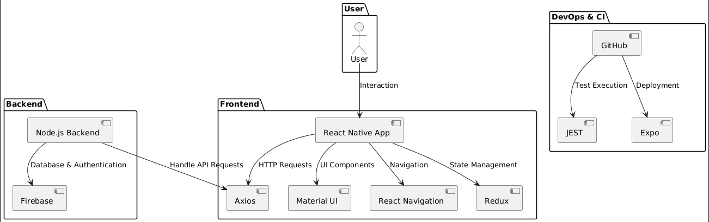

# Arquitetura da Solução

Definição de como o software é estruturado em termos dos componentes que fazem parte da solução e do ambiente de hospedagem da aplicação.

## Modelo ER

## Tecnologias Utilizadas

- **Frontend:** React Native | Typescript
- **Backend:** Node.js | Typescript
- **UI:** Material UI
- **Bibliotecas:** Axios | Redux | Magic UI | React Native Firebase | React Navigation
- **Banco de dados:** Firebase
- **Teste unitários:** JEST
- **Versionamento:** Git & Github
- **Hospedagem e deploy:** Expo

## Hospedagem

Para hospedar e lançar nosso aplicativo nas lojas de aplicativos, criaremos contas de desenvolvedor no Google Play Console e no Apple Developer Program. Utilizaremos o Expo para gerar builds de produção para Android e iOS, que serão então carregados nas respectivas plataformas. No Google Play Console, faremos o upload do arquivo AAB, preencheremos os detalhes do aplicativo e submeteremos para revisão. Na App Store, utilizaremos o App Store Connect para enviar o arquivo IPA, preencher as informações necessárias e submeter para revisão. Após a aprovação, o aplicativo estará disponível para download nas lojas de aplicativos, garantindo um processo estruturado e eficiente para o lançamento e manutenção contínua.

## Qualidade de Software

1. **Manutenibilidade**
    - **Modularidade**: A equipe irá estruturar o software em módulos independentes para facilitar atualizações e manutenção.
    - **Reusabilidade**: Componentes reutilizáveis no projeto irão aumentar a eficiência e reduzir retrabalho.
2. **Confiabilidade**
    - **Maturidade**: Para garantir que o sistema seja confiável, ele será submetido a revisões de código (Code Review) e testes unitários automatizados (JEST).
    - **Tolerância a falhas**: A utilização de Firebase como backend irá requerer um sistema resiliente a falhas, garantindo que os dados sejam armazenados com segurança.
3. **UI**
    - **Acessibilidade**: A interface do aplicativo será desenvolvida com Material UI, focando em proporcionar uma experiência de usuário intuitiva.
    - **Interfaces**: As histórias irão passar pelo XD Review, onde todos os pontos de design serão analisados e comparados ao protótipo fiel no Figma.
4. **Eficiência de Desempenho**
    - **Tempo de Resposta**: A equipe irá monitorar o tempo de carregamento das telas e operações, como requisições ao Firebase.
    - **Utilização de Recursos**: O uso de React Native irá garantir uma utilização eficiente dos recursos de dispositivos móveis.

### Métricas para avaliação da qualidade

- **Cobertura de Testes Unitários**: Será avaliada pelo JEST, garantindo que grande parte do código esteja coberta por testes automatizados.
- **Tempo de Resposta do Sistema**: A métrica será medida em tempo real e os dados serão armazenados no Firebase.
- **Satisfação do Usuário**: Será avaliada através de pesquisas ou feedback direto dos stakeholders após a entrega em produção.

> **Links Úteis**:
>
> - [ISO/IEC 25010:2011 - Systems and software engineering — Systems and software Quality Requirements and Evaluation (SQuaRE) — System and software quality models](https://www.iso.org/standard/35733.html/)
> - [Análise sobre a ISO 9126 – NBR 13596](https://www.tiespecialistas.com.br/analise-sobre-iso-9126-nbr-13596/)
> - [Qualidade de Software - Engenharia de Software 29](https://www.devmedia.com.br/qualidade-de-software-engenharia-de-software-29/18209/)
