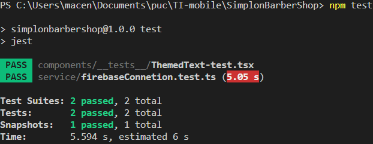
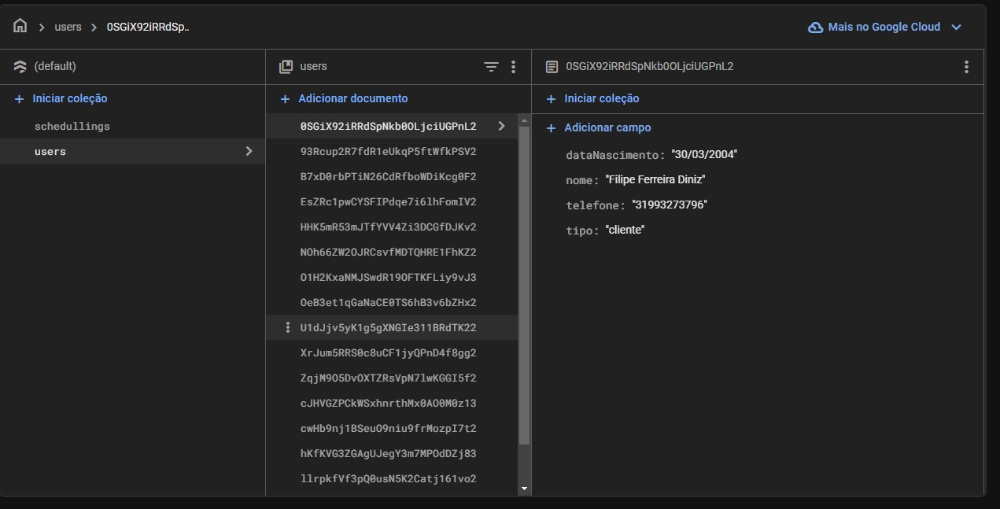
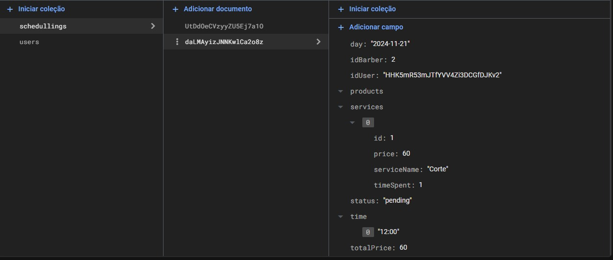

# Registro de Testes de Software

### Foi realizado o teste unitario do componente responsavel pela conexão com o firebase.

## Avaliação

O teste implementado para a conexão com o Firebase tem como objetivo verificar se a inicialização do Firebase ocorre corretamente com a configuração esperada. Utilizando o Jest como framework de testes, o mock da função initializeApp do Firebase é criado para garantir que, ao invocar o módulo de conexão, a função seja chamada com os parâmetros corretos, que incluem a apiKey, authDomain, projectId, entre outros. O teste simula a execução da inicialização do Firebase e, em seguida, valida se a chamada para initializeApp foi realizada com os dados esperados, assegurando que a configuração do Firebase está alinhada com as especificações do projeto SimplonBarberShop. Essa abordagem garante a integridade e a confiabilidade da configuração do Firebase, um componente crucial para a funcionalidade do sistema.

### Foi realizado o teste de autenticação e cadastro de usuários no firebase

### Foi realizado o teste de inserção de dados no firebase

